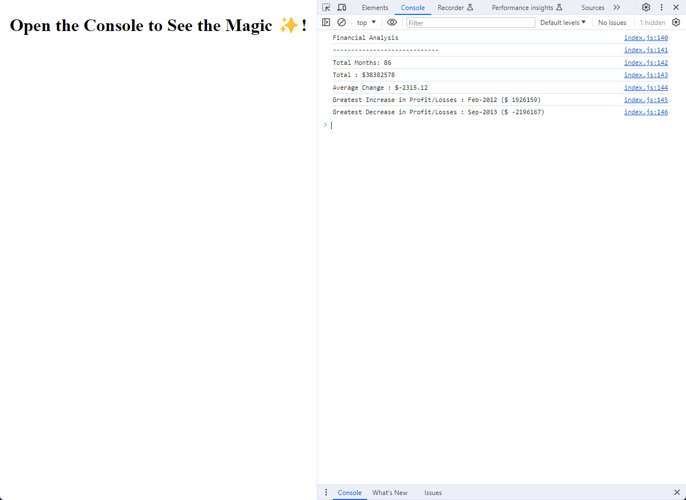

  

  <h3 align="center">Financial Analysis by using JavaScript</h3>

  

    This is a financial analysis code finding basic values like :
    <ul align="center" style="list-style-type: none">
      <li>Total months</li>
      <li>Total amount</li>
      <li>Average change by month</li>
      <li>Greatest increase value by month</li>
      <li>Greatest decrease value by month</li>
     
    
  

 
<a href="https://ozdilkazim.github.io/Console-Finances/">
  <h1> SEE LIVE PAGE</h1>
</a>
 

## Documentation for previous releases

- No previous release.

## Community

Get updates on Javascript Tutorial to learn how to code.

- W3 Schools JavaScript Tutorial (https://www.w3schools.com/js/).
- Learn JavaScript (https://learnjavascript.online/).
- The Modern JavaScript Tutorial (https://javascript.info/).

## Creator(s)

**Kazim OZDIL**

- <https://github.com/ozdilkazim>

## Copyright and license

Code and documentation copyright under MIT license